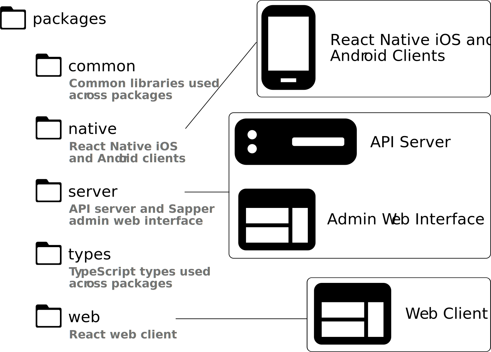

<h1></h1>

UpSwyng is a mobile-ready, digital directory of resources to assist the unhoused and at-risk communities. This is a [Code For Boulder](https://www.codeforboulder.org) project coming soon to Boulder County, Colorado.

## Getting Started

If you have any issues getting started using these directions, please see the [Troubleshooting section](#Troubleshooting).

### Requirements

Make sure you have these tools installed before you begin.

- Node.js version 14.3

- [Docker](https://docs.docker.com/get-docker/)

- [Yarn](https://classic.yarnpkg.com/en/docs/install/#mac-stable)

### Building your local dev environment

1. Clone (or fork and clone) this repository and `cd` into it

2. Make sure docker is running on your machine. You can check by running `docker ps` in your terminal

3. Run `yarn start:local`

## Project Organization



UpSwyng is a monorepo managed with [Yarn Workspaces](https://classic.yarnpkg.com/en/docs/workspaces/). It consists of five
packages all in the `packages` directory:

- [common](https://github.com/CodeForBoulder/upswyng/tree/master/packages/common) - contains common libraries and utilities used across the other packages
- [types](https://github.com/CodeForBoulder/upswyng/tree/master/packages/types) - contains the TypeScript definitions used across the project
- [server](https://github.com/CodeForBoulder/upswyng/tree/master/packages/server) - a [Sapper](https://sapper.svelte.dev/) application with two parts:
  - an API server which provides data to the UpSwyng clients
  - an admin web interface which uses the [Svelte](https://svelte.dev/) framework to create and modify data for the project
- [web](https://github.com/CodeForBoulder/upswyng/tree/master/packages/web) - contains the [React](https://reactjs.org/) web client
- [native](https://github.com/CodeForBoulder/upswyng/tree/master/packages/native) - contains a proof-of-concept [React Native](https://facebook.github.io/react-native/) client

## Working With Yarn Workspaces

To run a command in a specific package, use the `yarn workspace` command from the project root.
For example, to start the web package development server run:

```console
yarn workspace @upswyng/web start
```

To run the same command in _all_ workspaces, use `yarn workspaces`. For instance, to run `test` in all packages use:

```console
yarn workspaces run test
```

Typing out the full workspace name can get tedious. You can place aliases in your `.bashrc` or `.profile` to save time:

```console
alias @uw="yarn workspace @upswyng/web "
```

Now you only need `@uw start` to start the web dev server.

### Troubleshooting

#### The engine "node" is incompatible with this module.

When running `yarn` to install project dependencies, you may see a message that looks similar to:

```
The engine "node" is incompatible with this module. Expected version "^14.3.x". Got "11.15.0".
```

This just means that your machine's current version of node does not match the version required to run the UpSwyng server, 14.3.x. To fix this you'll need to install and which your current version of Node. [nvm](https://itnext.io/nvm-the-easiest-way-to-switch-node-js-environments-on-your-machine-in-a-flash-17babb7d5f1b#d594) is a helpful tool, among others, you could use to easily switch between node versions.

#### Type Errors

The packages `native`, `server`, and `web` depend on `common` and `types`. If you edit
`common` or `types`, or pull a new commit which contains edits to those packages, they need to be rebuilt.
If you do not rebuild, you may see a type error like:

```
upswyng/packages/server/src/utility/slackbot.ts(76,23): semantic error TS2551:
Property 'DraftApproved' does not exist on type '{ alert_live: any; draft_approved: any;
draft_created: any; draft_deleted: any; resource_issue_reopened: any; resource_issue_resolved: any;
user_permission_changed: any; }'. Did you mean 'draft_approved'?
```

To fix this, run the script:

```console
yarn build:local-packages
```

## Contributing

Pull requests are welcome and encouraged! Please review and follow our [guidelines](CONTRIBUTING.md).
